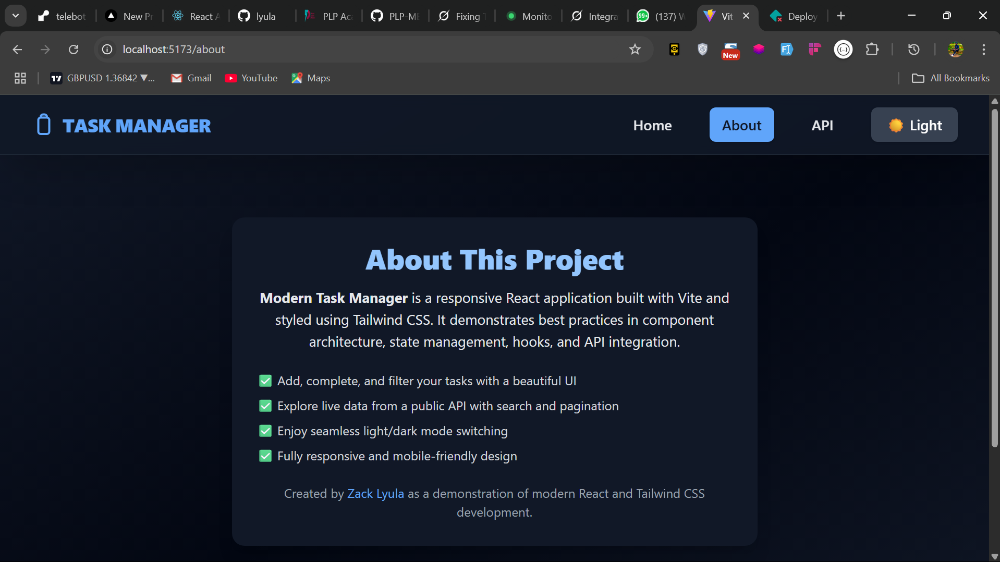
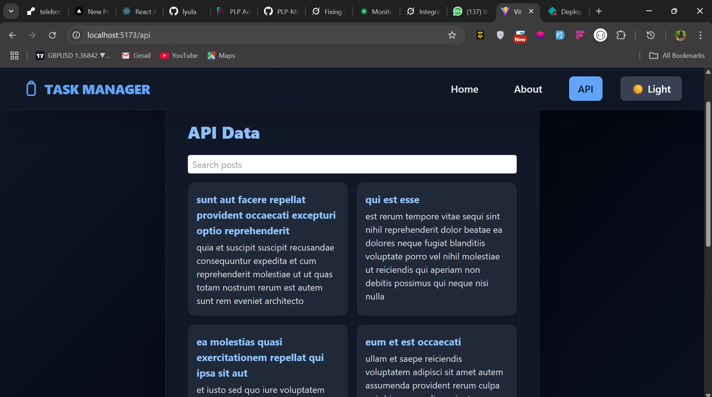
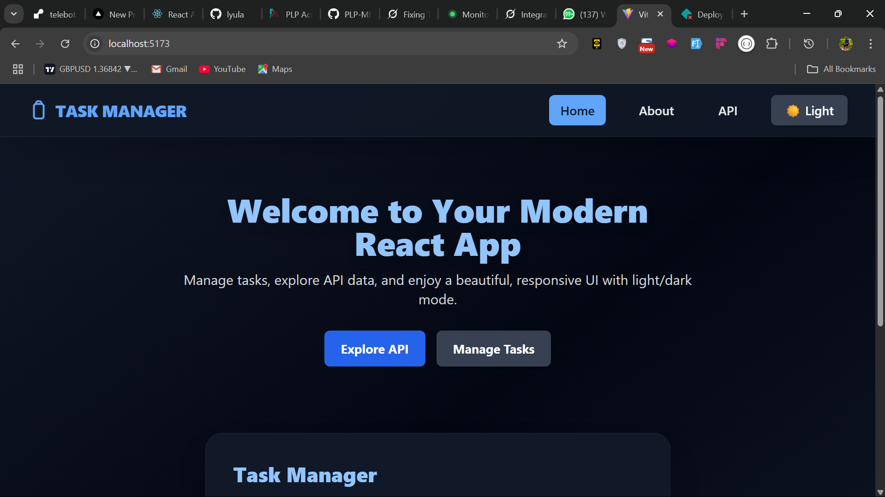
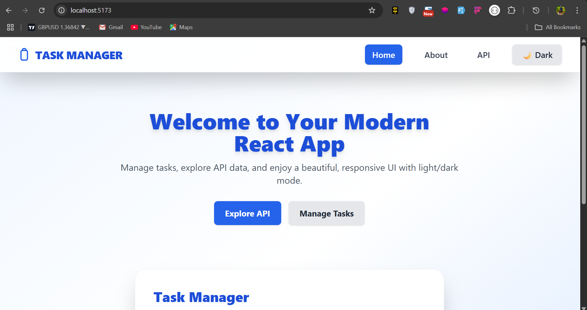
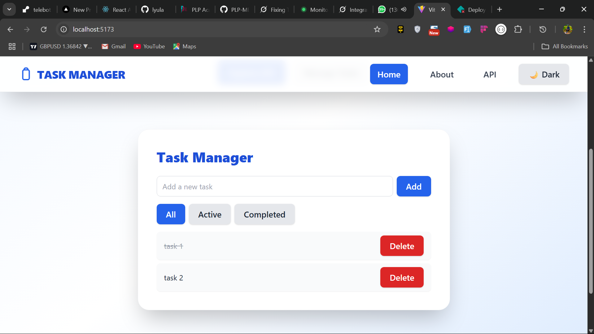

# Week 3 React JS Assignment - Task Manager

A modern, full-featured Task Manager web application built with **React 19**, **Vite**, and **Tailwind CSS**.

---

## 🌟 About This Platform

**Task Manager** is a productivity platform designed to help you organize, track, and manage your daily tasks efficiently.  
It provides a clean, intuitive interface for adding, completing, and filtering tasks, and also demonstrates integration with external APIs for real-world data handling.  
The platform is fully responsive, supports light/dark themes, and is optimized for both desktop and mobile experiences.

Whether you are a developer looking for a modern React+Tailwind starter, or a user wanting a simple yet powerful task management tool, this project showcases best practices in React component architecture, state management, and UI/UX design.

---

## 🚀 Features

- **Task Management:** Add, complete, and filter your tasks with a beautiful, interactive UI.
- **API Data Explorer:** Fetch and search live data from a public API with pagination.
- **Theme Switcher:** Seamless light/dark mode toggle for comfortable viewing.
- **Responsive Design:** Looks great on all devices, from mobile to desktop.
- **Modern Stack:** Built with React 19, Vite, and Tailwind CSS for speed and maintainability.

---

## 📸 Screenshots

> **How to add your own screenshots:**  
> Place your images in the `public` folder and reference them as shown below.







---

## 🛠️ Getting Started

1. **Install dependencies:**
   ```sh
   pnpm install
   ```
2. **Run the development server:**
   ```sh
   pnpm dev
   ```
3. **Build for production:**
   ```sh
   pnpm build
   ```

---

## 📂 Project Structure

```
src/
  components/      # React components
  context/         # Context providers (e.g., ThemeContext)
  hooks/           # Custom React hooks
  App.jsx          # Main app component
  main.jsx         # Entry point
  index.css        # Tailwind CSS imports and global styles
public/
  assets/          # Place your screenshots here or in public/
```

---

## 📝 License

MIT

---

## 🙋‍♂️ Author

- [Zack Lyula](https://github.com/lyula)

---

**Happy coding!**
